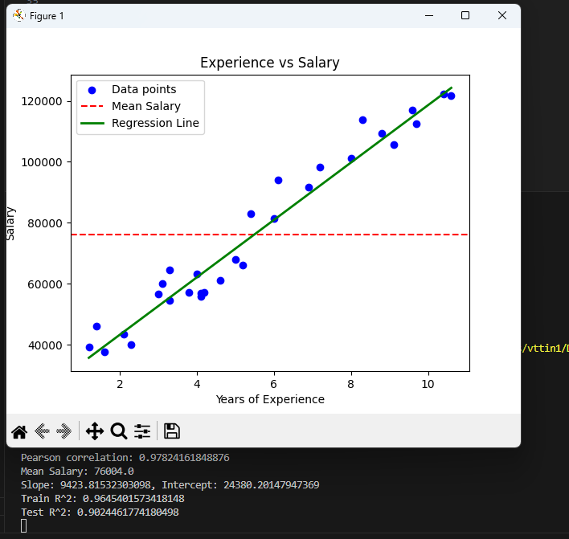
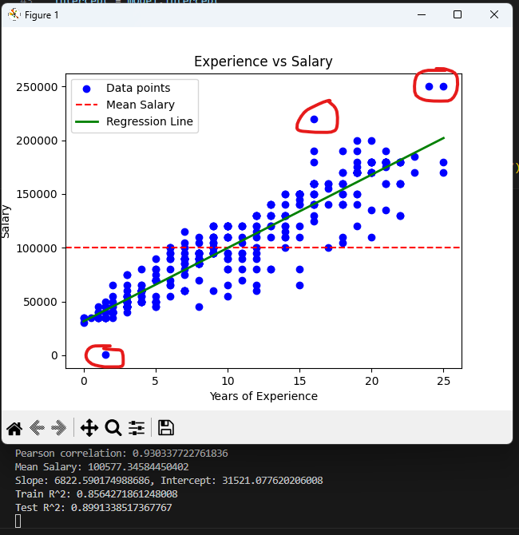
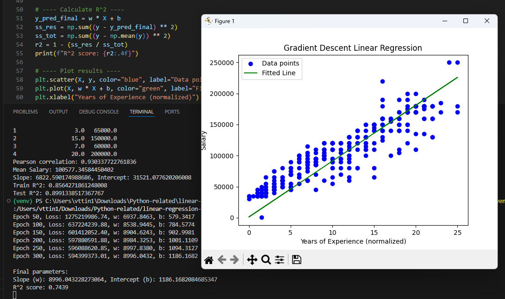

# Linear Regression Practice

This project demonstrates a simple linear regression model to predict salary based on years of experience. It includes:

- A small demo using a tiny dataset.
- A larger dataset example for more realistic results.
- A manual implementation using a custom loss function and gradient descent.

## Results

### 1. Small Dataset Demo

### 2. Larger Dataset Demo

### 3. Manual Implementation (Gradient Descent)

